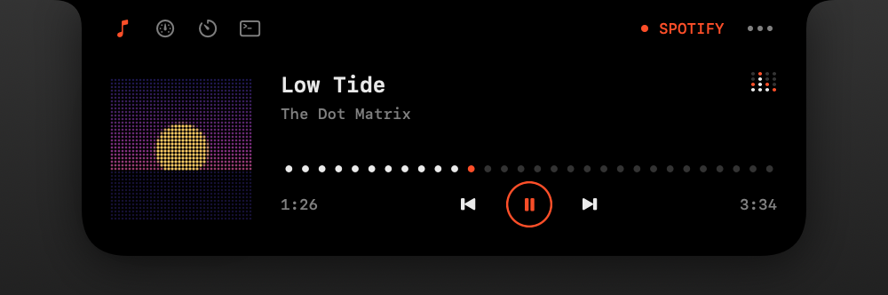
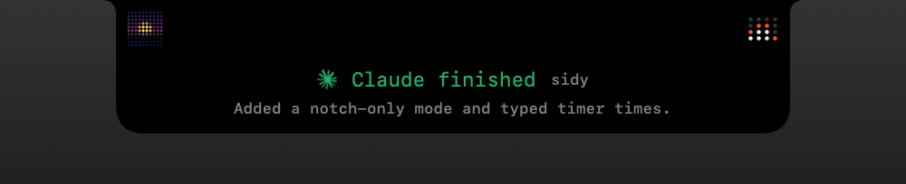
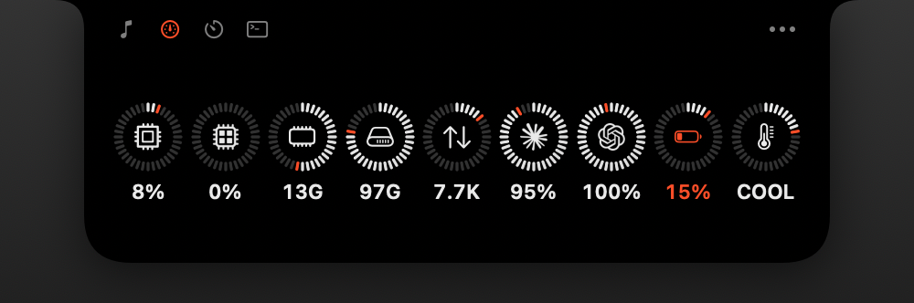
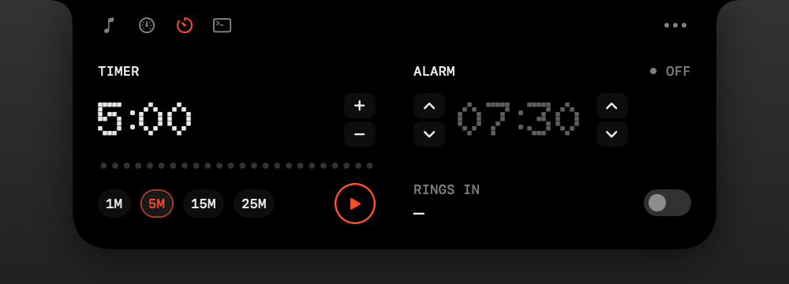
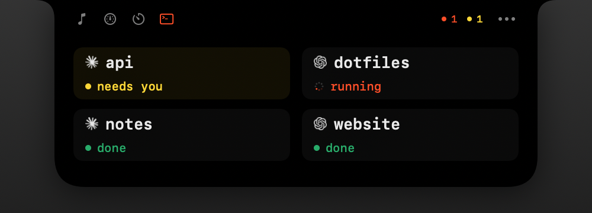

<p align="center">
  
</p>

<h1 align="center">Sidy</h1>

<p align="center">A dot-matrix system sidebar for your macOS desktop.</p>

<p align="center">
  <a href="https://github.com/odexion/sidy/releases/latest"></a>
  
  
</p>

## Install

```sh
curl -fsSL https://raw.githubusercontent.com/odexion/sidy/main/scripts/install.sh | sh
```

> [!TIP]
> Paste this line into Terminal. It downloads the latest release, installs it into `/Applications` and opens it, without sudo. After that, Sidy updates itself from the menu bar.

<p align="center">
  
</p>

Sidy sits on the edge of your desktop as a slim pill of gauges. Hover a tile to see its detailed card, or click the tile to pin the card open.

## What it shows

| Section | Details |
| --- | --- |
| CPU | Load and a short history |
| GPU | Utilization with peak and average |
| Memory | Used and free, counted the same way as Activity Monitor |
| Storage | Free, used and total space on the startup disk |
| Network | Download and upload speed with a sparkline |
| Claude | 5-hour and weekly limits left, with reset times |
| Codex | Plan limits left, with reset times |
| Battery | Charge, power source and time remaining |
| Now Playing | Spotify, Music, or YouTube Music in any browser, with controls and a seek bar |
| System | Thermal state, uptime and load average |
| Timer* | Countdown with presets, pause and +1 minute. Click the time to type one |
| Alarm* | Daily alarm with snooze and a countdown to the next ring. Click the time to type one |
| Notes* | A scratch note, saved as you type |

\*Off by default. Turn them on in Settings → Modules.

## Notch player

<p align="center">
  
</p>

Turn it on in **Settings → Notch**, or with **Show Notch** in the menu bar menu. Music lives in the notch: while a track is loaded, the notch widens to show the album art in dots and a small equalizer. New tracks peek out underneath for a moment. Hover the notch to drop it open on the music tab, with the seek bar and controls. Other tabs hold the timer and alarm controls, and, if you turn them on, your sidebar's gauges and your AI agent sessions. The `•••` beside them opens the notch's settings.

<table>
  <tr>
    <td width="50%"><br><sub><b>Closed:</b> the track's art and an equalizer beside the camera</sub></td>
    <td width="50%"><br><sub><b>Peek:</b> a new track or a finished agent reply</sub></td>
  </tr>
  <tr>
    <td><br><sub><b>Modules:</b> the sidebar's gauges in a row</sub></td>
    <td><br><sub><b>Timer &amp; alarm:</b> presets, typed times and the daily alarm</sub></td>
  </tr>
  <tr>
    <td><br><sub><b>AI:</b> Claude Code and Codex sessions, colored by state</sub></td>
    <td></td>
  </tr>
</table>

It also shows:

- A running timer counting down beside the notch. A ringing timer or alarm drops down with Stop.
- Short alerts for plugging in, unplugging and low battery, for a Claude or Codex limit dropping under 20% and 10%, and for the Mac running hot.

**AI agents:** turn on **Claude Code** or **Codex** under Settings → Notch → AI agents, and the notch tells you when a reply in your terminal finishes or the agent needs your permission. It shows the project and the start of the reply; click it to bring the terminal forward. The AI tab lists your sessions as tiles, colored by state (running, needs you, done or stopped), and shows your Claude and Codex limits when none are running. Codex asks you to approve new hooks once with `/hooks`. Turning a switch on adds Sidy's hooks to `~/.claude/settings.json` or `~/.codex/hooks.json`, next to any you already have. Turning it off removes them again, and the file's original is kept once as `.sidy-backup`.

Gestures work with two fingers on the notch. Swipe down to open and up to close. Swipe sideways to change tracks, and scroll for volume, on the closed notch or the music tab.

Every part can be switched on or off in Settings → Notch, and hovering a setting explains it. Scroll-for-volume, the modules and AI tabs, and the Claude Code and Codex alerts start off. By default the notch sits on the built-in display, or the main one when the lid is closed, and hides while an app is full screen. On displays without a notch, it hangs from the middle of the menu bar.

When a player doesn't share its artwork (browsers often drop it), Sidy looks the track up in the iTunes catalog, sending the title and artist to Apple.

## Customizing

- **Reorder:** drag tiles up or down the pill.
- **Hide a section:** right-click its tile.
- **Refresh AI usage:** right-click the Claude or Codex tile.
- **Settings:** click the `•••` under the pill to show or hide sections, reorder them, pick the screen edge, switch to the detailed card grid, or launch Sidy at login.
- **Notch only:** turn off **Show sidebar** in Settings → General to use Sidy from the notch and the menu bar alone.
- **Menu bar:** the gauge icon opens Settings, shows or hides the sidebar and the notch, refreshes AI usage, replays the opening animation, checks for updates or quits Sidy.

## Install options

Requires an Apple silicon Mac running macOS 14 or later.

The installer puts Sidy in `/Applications`, or in `~/Applications` if `/Applications` isn't writable. If Sidy is already running, it's quit, replaced and relaunched.

Options go in environment variables. For example, `SIDY_VERSION=v1.0.0` installs a specific release and `SIDY_NO_LAUNCH=1` skips opening Sidy afterwards. Run the script with `--help` to see them all.

<details>
<summary>Manual install</summary>

1. Download `Sidy-<version>-arm64.zip` from [Releases](https://github.com/odexion/sidy/releases) and unzip it.
2. Move `Sidy.app` to `/Applications`.
3. Sidy is not notarized, so macOS blocks it the first time you open it. Remove the quarantine flag:
   ```sh
   xattr -dr com.apple.quarantine /Applications/Sidy.app
   ```
   Or open it once, then go to **System Settings → Privacy & Security** and click **Open Anyway**.

</details>

Sidy runs from the menu bar and has no Dock icon. It sits at desktop level, so it shows whenever the desktop is visible.

## Updating

Sidy checks for new releases at launch and every 6 hours. When one is out, an orange dot appears on the menu bar icon. Choose **Restart to Update** from its menu, and Sidy downloads the release, replaces itself and relaunches. **Check for Updates…** checks right away. Versions before 1.2.0 can't update themselves, so run the install command again.

## How it gets its data

- **System stats** come from public macOS APIs (Mach, IOKit, IOPowerSources).
- **Claude limits** use the sign-in Claude Code stores in your keychain. **Codex limits** use `~/.codex/auth.json`. Each is sent only to its own provider's usage endpoint. Neither endpoint is officially documented, so either may change.
- **Now Playing:** macOS only lets Apple-signed processes read the system "now playing" session. Sidy therefore loads a small helper library (`Sources/MediaBridge`) inside `/usr/bin/perl` to read it. This is an unofficial workaround that a future macOS update could break.

## Performance

Measured on a MacBook Pro (M4 Pro, 24 GB, macOS 27) running Sidy 1.6.0 with music playing. Each setup ran for 45 seconds after it settled, sampled once a second with `top`. CPU is a share of one core.

| Setup | CPU average | CPU peak (95th %) | Memory average |
| --- | --- | --- | --- |
| Sidebar only: pill, default modules, no notch | 1.3% | 3.6% | 94 MB |
| **Full:** pill with every module, notch with every feature, closed | 5.4% | 8.4% | 164 MB |
| Full, notch held open on the music tab | 9.5% | 21% | 185 MB |
| Full, with the detailed card grid in place of the pill | 14.4% | 18.9% | 175 MB |

- **Now Playing helper:** the long-running bridge process uses about 0.01% CPU and 4.5 MB. It only wakes when the track or playback changes.
- **Agent hooks:** each Claude Code or Codex event starts Sidy briefly as a hook, which finishes in about 10 ms. The hooks run in the background, so they never hold up a reply.
- **Memory** is highest right after launch and settles over the first few minutes. The sidebar-only setup was down to a 34 MB footprint a minute after launch.
- **Network:** Claude and Codex limits refresh every 5 minutes, and Sidy checks for updates every 6 hours.
- **Size:** the app is 3.8 MB, and the download is 1.1 MB.

## Building

```sh
./build.sh            # build/Sidy.app
./build.sh --install  # replace the installed copy and launch it
./build.sh --release  # also package build/Sidy-<version>-arm64.zip
swift scripts/make-icon.swift  # regenerate the app icon
```

`SIDY_FLOATING=1 .build/debug/Sidy` keeps the panel above other windows while developing. `.build/debug/Sidy --snapshot docs/notch notch` renders the notch images above.

## Credits

- [Doto](https://github.com/oliverlalan/Doto), the dot-matrix typeface (SIL Open Font License, see `Resources/Doto-OFL.txt`).
- Claude and OpenAI marks from [Simple Icons](https://simpleicons.org). They are trademarks of their respective owners.
