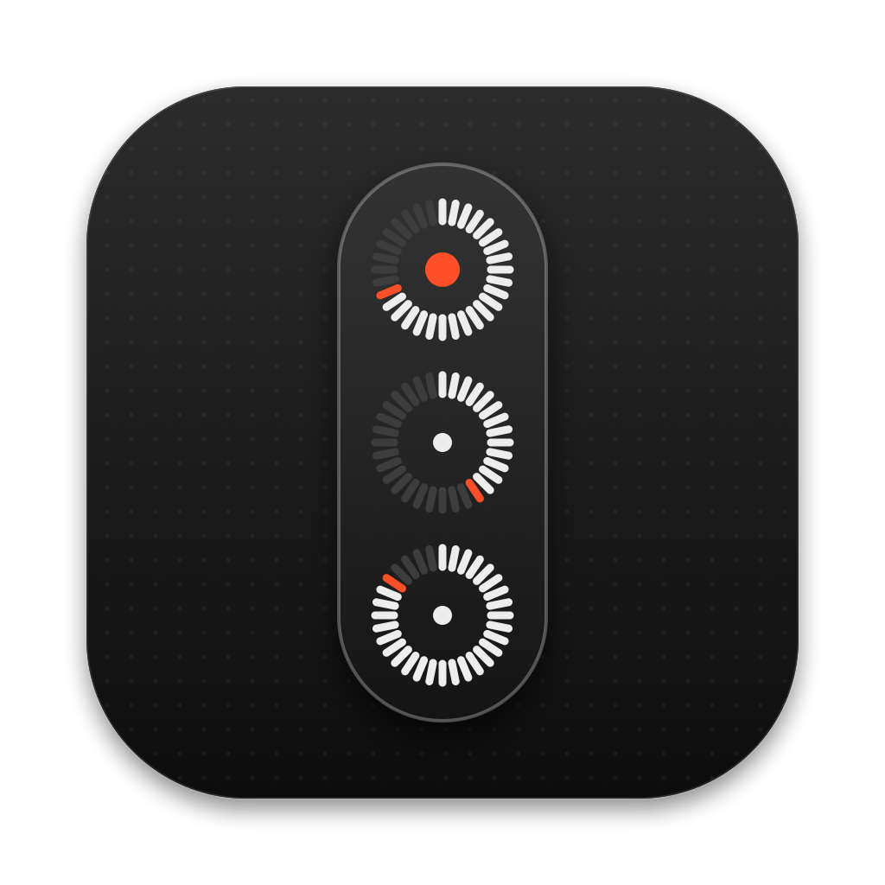
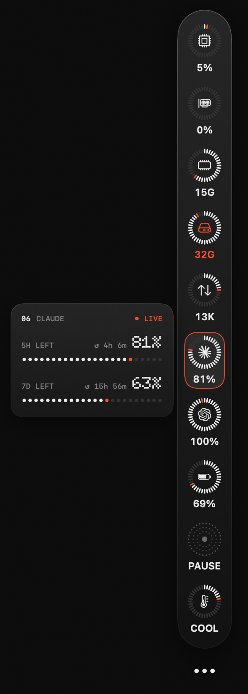

<p align="center">
  
</p>

<h1 align="center">Sidy</h1>

<p align="center">A dot-matrix system sidebar for your macOS desktop.</p>

<p align="center">
  <a href="https://github.com/odexion/sidy/releases/latest"></a>
  
  
</p>

## Install

```sh
curl -fsSL https://raw.githubusercontent.com/odexion/sidy/main/scripts/install.sh | sh
```

> [!TIP]
> Paste this line into Terminal. It downloads the latest release, installs it into `/Applications` and opens it, without sudo. After that, Sidy updates itself from the menu bar.

<p align="center">
  
</p>

Sidy sits on the edge of your desktop as a slim pill of gauges. Hover a tile to see its detailed card, or click the tile to pin the card open.

## What it shows

| Section | Details |
| --- | --- |
| CPU | Load and a short history |
| GPU | Utilization with peak and average |
| Memory | Used and free, counted the same way as Activity Monitor |
| Storage | Free, used and total space on the startup disk |
| Network | Download and upload speed with a sparkline |
| Claude | 5-hour and weekly limits left, with reset times |
| Codex | Plan limits left, with reset times |
| Battery | Charge, power source and time remaining |
| Now Playing | Spotify, Music, or YouTube Music in any browser, with controls and a seek bar |
| System | Thermal state, uptime and load average |
| Timer* | Countdown with presets, pause and +1 minute |
| Alarm* | Daily alarm with snooze and a countdown to the next ring |
| Notes* | A scratch note, saved as you type |

\*Off by default. Turn them on in Settings → Modules.

## Customizing

- **Reorder:** drag tiles up or down the pill.
- **Hide a section:** right-click its tile.
- **Settings:** click the `•••` under the pill to show or hide sections, reorder them, pick the screen edge, switch to the detailed card grid, or launch Sidy at login.
- **Menu bar:** the gauge icon opens Settings, refreshes AI usage, replays the opening animation, checks for updates or quits Sidy.

## Install options

Requires an Apple silicon Mac running macOS 14 or later.

The installer puts Sidy in `/Applications`, or in `~/Applications` if `/Applications` isn't writable. If Sidy is already running, it's quit, replaced and relaunched.

Options go in environment variables. For example, `SIDY_VERSION=v1.0.0` installs a specific release and `SIDY_NO_LAUNCH=1` skips opening Sidy afterwards. Run the script with `--help` to see them all.

<details>
<summary>Manual install</summary>

1. Download `Sidy-<version>-arm64.zip` from [Releases](https://github.com/odexion/sidy/releases) and unzip it.
2. Move `Sidy.app` to `/Applications`.
3. Sidy is not notarized, so macOS blocks it the first time you open it. Remove the quarantine flag:
   ```sh
   xattr -dr com.apple.quarantine /Applications/Sidy.app
   ```
   Or open it once, then go to **System Settings → Privacy & Security** and click **Open Anyway**.

</details>

Sidy runs from the menu bar and has no Dock icon. It sits at desktop level, so it shows whenever the desktop is visible.

## Updating

Sidy checks for new releases at launch and every 6 hours. When one is out, an orange dot appears on the menu bar icon. Choose **Restart to Update** from its menu, and Sidy downloads the release, replaces itself and relaunches. **Check for Updates…** checks right away. Versions before 1.2.0 can't update themselves, so run the install command again.

## How it gets its data

- **System stats** come from public macOS APIs (Mach, IOKit, IOPowerSources).
- **Claude limits** use the sign-in Claude Code stores in your keychain. **Codex limits** use `~/.codex/auth.json`. Each is sent only to its own provider's usage endpoint. Neither endpoint is officially documented, so either may change.
- **Now Playing:** macOS only lets Apple-signed processes read the system "now playing" session. Sidy therefore loads a small helper library (`Sources/MediaBridge`) inside `/usr/bin/perl` to read it. This is an unofficial workaround that a future macOS update could break.

## Building

```sh
./build.sh            # build/Sidy.app
./build.sh --install  # copy to ~/Applications and launch
./build.sh --release  # also package build/Sidy-<version>-arm64.zip
swift scripts/make-icon.swift  # regenerate the app icon
```

`SIDY_FLOATING=1 .build/debug/Sidy` keeps the panel above other windows while developing.

## Credits

- [Doto](https://github.com/oliverlalan/Doto), the dot-matrix typeface (SIL Open Font License, see `Resources/Doto-OFL.txt`).
- Claude and OpenAI marks from [Simple Icons](https://simpleicons.org). They are trademarks of their respective owners.
